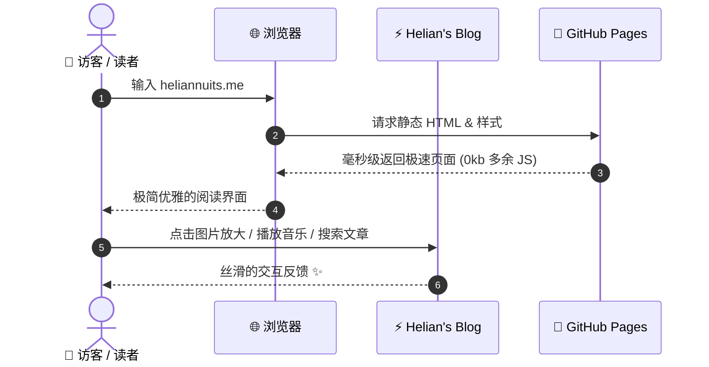

import { Icon } from "astro-icon/components";
import { Tweet, YouTube } from "astro-embed";
import CodePen from "@/components/mdx/CodePen.astro";
import Bilibili from "@/components/mdx/Bilibili.astro";
import NetEaseMusic from "@/components/mdx/NetEaseMusic.astro";
import AudioPlayer from "@/components/mdx/AudioPlayer.astro";
import GitHubCard from "@/components/mdx/GitHubCard.astro";

欢迎访问 **Helian's Blog** 全组件展示页面！

本页面专为集中检验和体验当前博客系统所支持的全部排版能力、交互组件与富媒体生态而设计。

---

## 目录导航

- [1. 矢量图标库（Iconify 20万+ 图标）](#1-矢量图标库iconify-20万-图标)
- [2. 提示卡片（Callouts / Alerts）](#2-提示卡片callouts--alerts)
- [3. 代码块与语法高亮（Shiki + Copy Button）](#3-代码块与语法高亮shiki--copy-button)
- [4. 图片与灯箱缩放（Medium Zoom）](#4-图片与灯箱缩放medium-zoom)
- [5. 国内音视频组件（Bilibili & 网易云）](#5-国内音视频组件bilibili--网易云)
- [6. 国际社交与沙盒嵌入（CodePen & YouTube & X）](#6-国际社交与沙盒嵌入codepen--youtube--x)
- [7. GitHub 开源项目动态卡片](#7-github-开源项目动态卡片)
- [8. LaTeX 学术数学公式（KaTeX）](#8-latex-学术数学公式katex)
- [9. Mermaid 流程图与时序图](#9-mermaid-流程图与时序图)
- [10. 任务清单、表格与折叠详情](#10-任务清单表格与折叠详情)

---

## 1. 矢量图标库（Iconify 20万+ 图标）

无需引入笨重的静态字体包，构建时自动编译为轻量 SVG：

<div class="flex flex-wrap items-center gap-6 my-6 p-5 rounded-2xl border border-border bg-foreground/5 not-prose">
  <div class="flex items-center gap-2">
    <Icon name="lucide:sparkles" class="size-6 text-yellow-500" />
    <span class="font-medium">Lucide Sparkles</span>
  </div>
  <div class="flex items-center gap-2">
    <Icon name="lucide:palette" class="size-6 text-blue-500" />
    <span class="font-medium">Theme Palette</span>
  </div>
  <div class="flex items-center gap-2">
    <Icon name="tabler:brand-github" class="size-6 text-accent" />
    <span class="font-medium">GitHub</span>
  </div>
  <div class="flex items-center gap-2">
    <Icon name="simple-icons:bilibili" class="size-6 text-[#00A1D6]" />
    <span class="font-medium">Bilibili</span>
  </div>
  <div class="flex items-center gap-2">
    <Icon name="simple-icons:zhihu" class="size-6 text-[#0066FF]" />
    <span class="font-medium">知乎</span>
  </div>
  <div class="flex items-center gap-2">
    <Icon name="lucide:music" class="size-6 text-pink-500" />
    <span class="font-medium">Music</span>
  </div>
</div>

---

## 2. 提示卡片（Callouts / Alerts）

原生支持 GitHub 风格的语义化 Callouts 提示块：

> [!NOTE]
> **这是一个提示说明（NOTE）**：用于提供背景信息、补充说明或上下文上下文。

> [!TIP]
> **这是一个最佳实践建议（TIP）**：推荐将常用组件放在 `src/components/mdx/` 目录下方便快速复用。

> [!IMPORTANT]
> **这是一个重要提醒（IMPORTANT）**：生产打包时会自动生成离线 Pagefind 全文检索索引。

> [!WARNING]
> **这是一个警告提示（WARNING）**：如果修改了 `astro-paper.config.ts` 中的站点域名，请同步确认 `CNAME` 文件。

> [!CAUTION]
> **这是一个高危警示（CAUTION）**：敏感 Token 与密钥切勿直接提交到公开仓库中。

---

## 3. 代码块与语法高亮（Shiki + Copy Button）

支持 VS Code 同款的 Shiki 语法高亮引擎，自带一键复制代码按钮、行高亮与 Diff 对比：

```typescript file="greet.ts" {3}
// 这是一个 TypeScript 示例
export function welcomeUser(name: string): string {
  const greeting = `Hello, ${name}! Welcome to Helian's Blog.`; // [!code highlight]
  console.log(greeting);
  return greeting;
}

welcomeUser("Helian");
```

### 代码修改 Diff 演示

```diff
- const framework = "Hexo";
+ const framework = "Astro + AstroPaper"; // 更快、更轻量、0 客户端 JS
```

---

## 4. 图片与灯箱缩放（Medium Zoom）

点击下方图片试试看！支持平滑弹出放大、背景变暗聚焦、滚轮/捏合缩放以及按 `ESC` 键关闭：


---

## 5. 国内音视频组件（Bilibili & 网易云）

### 哔哩哔哩（Bilibili）高清响应式视频嵌入
自适应 16:9 比例，手机和桌面端均完美适配：

<Bilibili bvid="BV1xx411c7mD" />

### 网易云音乐卡片播放器
嵌入单曲或歌单，支持在博文中直接播放音乐：

<NetEaseMusic id="186016" />

### 自定义外链音频播放器
适用于播客、背景音效或自建音频：

<AudioPlayer
  src="https://www.soundhelix.com/examples/mp3/SoundHelix-Song-1.mp3"
  title="Relaxing Ambient Beats"
  artist="Helian's Selection"
/>

---

## 6. 国际社交与沙盒嵌入（CodePen & YouTube & X）

### CodePen 在线可运行前端代码
读者可以直接在页面中看动效，甚至在线修改 HTML / CSS / JS 实时调试：

<CodePen id="https://codepen.io/argyleink/pen/eYpRgpy" />

### YouTube 极速懒加载视频
采用 Facade 延迟加载技术，未点击播放前仅加载静态预览图，节省 1MB+ 网络流量：

<YouTube id="dQw4w9WgXcQ" />

---

## 7. GitHub 开源项目动态卡片

在博文中介绍你的项目或推荐开源库：

<GitHubCard
  repo="SXP-Simon/SXP-Simon.github.io"
  description="Helian 的极简个人博客，基于 Astro + AstroPaper 打造，支持全量富媒体组件与 GitHub Pages 自动部署。"
  language="TypeScript"
/>

---

## 8. LaTeX 学术数学公式（KaTeX）

支持行内公式如质能方程 $E = mc^2$，以及复杂的块级多行公式与矩阵渲染：

### 高斯正态分布密度函数
$$
f(x) = \frac{1}{\sigma \sqrt{2\pi}} e^{-\frac{1}{2}\left(\frac{x-\mu}{\sigma}\right)^2}
$$

### 麦克斯韦方程组（微分形式）
$$
\begin{aligned}
\nabla \cdot \mathbf{E} &= \frac{\rho}{\varepsilon_0} \\
\nabla \cdot \mathbf{B} &= 0 \\
\nabla \times \mathbf{E} &= -\frac{\partial \mathbf{B}}{\partial t} \\
\nabla \times \mathbf{B} &= \mu_0\left(\mathbf{J} + \varepsilon_0 \frac{\partial \mathbf{E}}{\partial t}\right)
\end{aligned}
$$

---

## 9. Mermaid 流程图与时序图

在 Markdown 代码块中使用 `mermaid` 标记，即可自动渲染为清晰的矢量图表，且自适应深色/浅色模式：



---

## 10. 任务清单、表格与折叠详情

### 任务待办清单（Task List）
- [x] 克隆 GitHub 博客仓库
- [x] 搭建 Astro + AstroPaper 极简博客核心框架
- [x] 配置作者名称为 **Helian** 并绑定 `heliannuits.me`
- [x] 配置 GitHub Actions 自动构建部署流（`.github/workflows/deploy.yml`）
- [x] 集成 `astro-icon` 与 20万+ 图标库
- [x] 集成图片灯箱缩放、LaTeX 数学公式与 Mermaid 流程图
- [x] 编写组件全景展示 Demo Page

### 表格排版（Markdown Table）

| 组件分类 | 支持生态 | 渲染方式 | 客户端性能开销 |
| :--- | :--- | :--- | :--- |
| **图标库** | Lucide / Tabler / Simple Icons | 构建时内联 SVG | **0 KB JS** |
| **公式** | KaTeX / LaTeX | 服务端预渲染 HTML | **0 KB JS** |
| **流程图** | Mermaid.js | 客户端按需异步加载 | 极轻量 |
| **视频/音频** | Bilibili / YouTube / 网易云 | 响应式自适应 iframe / HTML5 | 懒加载 |
| **代码高亮** | Shiki (VS Code 同款) | 服务端静态生成高亮标记 | **0 KB JS** |

### 折叠详情卡片（Details）

<details>
<summary>👉 点击展开查看博文 Frontmatter 编写模版</summary>

```markdown
---
author: Helian
pubDatetime: 2026-08-20T16:00:00Z
title: 我的新文章标题
featured: true
draft: false
tags:
  - 技术
  - 随笔
description: 一句话概述本文核心要点
---

从这里开始撰写正文...
```

</details>

---

欢迎在右上角切换 **浅色 / 深色主题** 或使用 **搜索功能** 体验本站的完整功能！
