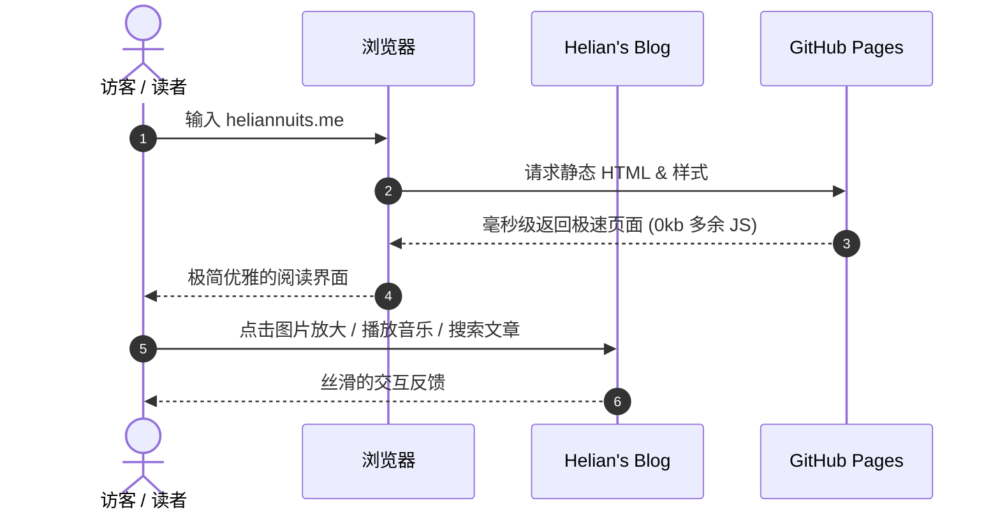
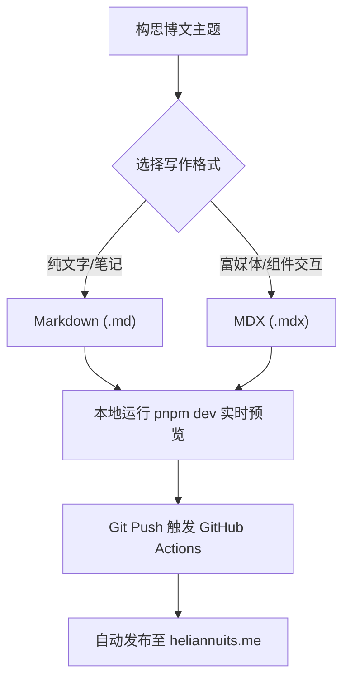

import { Icon } from "astro-icon/components";
import { Tweet, YouTube, LinkPreview } from "astro-embed";
import SocialEmbed from "@/components/mdx/SocialEmbed.astro";
import Bilibili from "@/components/mdx/Bilibili.astro";
import NetEaseMusic from "@/components/mdx/NetEaseMusic.astro";
import AudioPlayer from "@/components/mdx/AudioPlayer.astro";
import GitHubCard from "@/components/mdx/GitHubCard.astro";

欢迎查阅 **Helian's Blog** 全组件与语法全景参考手册。

你可以把本篇文档当做日常博文写作的 **组件字典与模板仓库**。在这里，你可以直观查看所有组件的真实渲染效果，并直接复制对应的代码片段应用到你的新文章中。

---

## 目录索引

- [1. 基础排版与文本样式](#1-基础排版与文本样式)
- [2. 提示卡片（Callouts / Alerts）](#2-提示卡片callouts--alerts)
- [3. 现代代码高亮系统（Shiki）](#3-现代代码高亮系统shiki)
- [4. 矢量图标库（astro-icon + Iconify）](#4-矢量图标库astro-icon--iconify)
- [5. 图片优化与灯箱缩放（Medium Zoom）](#5-图片优化与灯箱缩放medium-zoom)
- [6. 音频与音乐播放组件](#6-音频与音乐播放组件)
- [7. 视频与多媒体嵌入](#7-视频与多媒体嵌入)
- [8. 社交媒体与帖子引用嵌入（知乎 / 小红书 / Reddit / X）](#8-社交媒体与帖子引用嵌入知乎--小红书--reddit--x)
- [9. GitHub 开源项目卡片](#9-github-开源项目卡片)
- [10. LaTeX 数学公式排版（KaTeX）](#10-latex-数学公式排版katex)
- [11. Mermaid 矢量流程图与时序图](#11-mermaid-矢量流程图与时序图)
- [12. 任务清单、表格与折叠详情](#12-任务清单表格与折叠详情)
- [13. Frontmatter 博文配置参数速查](#13-frontmatter-博文配置参数速查)

---

## 1. 基础排版与文本样式

本站基于 Tailwind Typography 进行了细致的字阶、行距与呼吸感调优：

### 文本修饰与强调
* **粗体强调**：`**粗体文字**`
* *斜体强调*：`*斜体文字*`
* ~~删除线~~：`~~删除线内容~~`
* `行内代码片段`：`\`const x = 42;\``
* [超链接展示](https://heliannuits.me)：`[链接文本](URL)`

### 引用块（Blockquote）
> 读书不是为了雄辩和驳斥，也不是为了轻信和盲从，而是为了思考和权衡。
> 
> —— 弗朗西斯·培根

---

## 2. 提示卡片（Callouts / Alerts）

原生支持 GitHub 与 Obsidian 风格的语义化 Callouts 提示块，帮助读者快速抓住核心信息：

> [!NOTE]
> **提示说明（NOTE）**：用于补充上下文背景、技术原理或通用说明信息。

> [!TIP]
> **技巧建议（TIP）**：提供最佳实践建议，例如“推荐使用 WebP 格式以获得更快的加载速度”。

> [!IMPORTANT]
> **重要事项（IMPORTANT）**：需要读者特别注意的关键约束或必要前置条件。

> [!WARNING]
> **警告提示（WARNING）**：提醒可能存在的兼容性差异、潜在风险或破坏性修改。

> [!CAUTION]
> **危险告诫（CAUTION）**：涉及数据丢失、私钥泄露等高危操作的明确告诫。

---

## 3. 现代代码高亮系统（Shiki）

采用 VS Code 同款的 **Shiki** 代码高亮引擎，支持文件名显示、行高亮、Diff 对比与一键复制代码：

### 文件名与行聚焦高亮
通过 `file="filename"` 标注文件名，通过 `{line}` 指定聚焦高亮行：

```typescript file="auth.ts" {2,5}
import { generateToken } from "@/utils/jwt";

export async function authenticate(userId: string): Promise<string> {
  const secretKey = process.env.JWT_SECRET;
  return await generateToken({ id: userId }, secretKey);
}
```

### 代码修改对比（Diff）
在代码块语言后使用 `diff`，用 `+` 和 `-` 表示增删：

```diff file="astro.config.ts"
- const theme = "classic";
+ const theme = "astro-paper-minimal"; // 升级至极简现代主题
```

### 多语言高亮支持（Python, Rust, Shell, JSON）

```python file="server.py"
from fastapi import FastAPI

app = FastAPI()

@app.get("/")
def read_root():
    return {"message": "Hello from Helian's Server"}
```

```bash file="deploy.sh"
# 构建静态站点并更新搜索索引
pnpm build
```

---

## 4. 矢量图标库（astro-icon + Iconify）

无需引入字体包，构建时自动编译为内联 SVG，**0 运行时客户端 JS 开销**：

<div class="flex flex-wrap items-center gap-6 my-6 p-5 rounded-2xl border border-border bg-foreground/5 not-prose">
  <div class="flex items-center gap-2">
    <Icon name="lucide:sparkles" class="size-5 text-accent" />
    <span class="font-medium text-foreground">Lucide</span>
  </div>
  <div class="flex items-center gap-2">
    <Icon name="lucide:layers" class="size-5 text-accent" />
    <span class="font-medium text-foreground">Layers</span>
  </div>
  <div class="flex items-center gap-2">
    <Icon name="tabler:brand-github" class="size-5 text-accent" />
    <span class="font-medium text-foreground">GitHub</span>
  </div>
  <div class="flex items-center gap-2">
    <Icon name="simple-icons:bilibili" class="size-5 text-[#00A1D6]" />
    <span class="font-medium text-foreground">Bilibili</span>
  </div>
  <div class="flex items-center gap-2">
    <Icon name="simple-icons:zhihu" class="size-5 text-[#0066FF]" />
    <span class="font-medium text-foreground">知乎</span>
  </div>
  <div class="flex items-center gap-2">
    <Icon name="lucide:terminal" class="size-5 text-accent" />
    <span class="font-medium text-foreground">Terminal</span>
  </div>
  <div class="flex items-center gap-2">
    <Icon name="lucide:book-open" class="size-5 text-accent" />
    <span class="font-medium text-foreground">Docs</span>
  </div>
</div>

#### 使用方法：
```mdx
import { Icon } from "astro-icon/components";

<Icon name="lucide:sparkles" class="size-5 text-accent" />
<Icon name="tabler:brand-github" class="size-5" />
<Icon name="simple-icons:bilibili" class="size-5 text-[#00A1D6]" />
```

---

## 5. 图片优化与灯箱缩放（Medium Zoom）

博文内的所有图片均支持 **点击全屏聚焦预览**：
* 带有背景毛玻璃与暗色遮罩
* 支持滚轮缩放、双击缩放、移动端双指捏合
* 按 `ESC` 键或点击遮罩随时平滑退出


---

## 6. 音频与音乐播放组件

### 网易云音乐嵌入（`<NetEaseMusic />`）
支持单曲与歌单卡片嵌入，无需离开博文即可在线试听（示例为川田まみ《Wings of Courage -空を超えて-》）：

<NetEaseMusic id="32098307" />

```mdx
import NetEaseMusic from "@/components/mdx/NetEaseMusic.astro";

<!-- 传入网易云歌曲 ID（支持单曲与歌单） -->
<NetEaseMusic id="32098307" />
```

### 自定义极简音频播放器（`<AudioPlayer />`）
适用于播客录音、背景白噪音或自建音效文件：

<AudioPlayer
  src="https://www.soundhelix.com/examples/mp3/SoundHelix-Song-1.mp3"
  title="Relaxing Ambient Beats"
  artist="Helian's Selection"
/>

```mdx
import AudioPlayer from "@/components/mdx/AudioPlayer.astro";

<AudioPlayer
  src="https://example.com/audio.mp3"
  title="音频标题"
  artist="作者/演播者"
/>
```

---

## 7. 视频与多媒体嵌入

### 哔哩哔哩（Bilibili）高清响应式视频（`<Bilibili />`）
自适应 16:9 比例，自动适配移动端与暗黑主题：

<Bilibili bvid="BV1xx411c7mD" />

```mdx
import Bilibili from "@/components/mdx/Bilibili.astro";

<!-- 传入 B站视频 BV 号即可 -->
<Bilibili bvid="BV1xx411c7mD" />
```

### YouTube 极速懒加载视频（`astro-embed`）
采用 Facade 延迟加载技术，未点击前仅加载轻量海报，节省 1MB+ 流量：

<YouTube id="dQw4w9WgXcQ" />

```mdx
import { YouTube } from "astro-embed";

<YouTube id="dQw4w9WgXcQ" />
```

---

## 8. 社交媒体与帖子引用嵌入（知乎 / 小红书 / Reddit / X）

支持在博文中优雅地引用国内外主流社交媒体与社区的精彩动态、观点或热帖：

### 知乎精选回答引用
<SocialEmbed
  platform="zhihu"
  author="知乎答主"
  handle="优秀科技创作者"
  date="2026年"
  title="如何评价 Astro 框架与现代化静态站点生成器？"
  content="Astro 的 Island Architecture（孤岛架构）真正做到了在默认 0 客户端 JS 的前提下，允许在同一页面自由混用 React、Vue 或纯 Svelte 组件，兼顾极致的加载性能与开发灵活性..."
  url="https://www.zhihu.com"
  likes="2.4k"
  comments="386"
/>

### 小红书笔记引用
<SocialEmbed
  platform="xiaohongshu"
  author="数字游民Helian"
  handle="@helian"
  content="记录搭建极简博客的第一天！AstroPaper 主题真的太懂极简审美了，黑白灰配色配上代码高亮和 LaTeX 公式，写技术笔记和日常随笔非常舒服～"
  url="https://www.xiaohongshu.com"
  image="https://images.unsplash.com/photo-1499750310107-5fef28a66643?auto=format&fit=crop&w=800&q=80"
  likes="1.2k"
  comments="88"
/>

### Reddit 社区热帖引用
<SocialEmbed
  platform="reddit"
  author="u/web_developer"
  handle="r/webdev"
  title="Why static-first architecture is taking over personal blogs in 2026"
  content="Moving from heavy SPA frameworks to zero-JS static HTML with Pagefind search gave me 100/100 Lighthouse performance scores across the board."
  url="https://www.reddit.com"
  likes="4.5k"
  comments="521"
/>

### X (Twitter) 动态嵌入
<SocialEmbed
  platform="x"
  author="Astro"
  handle="@astrodotbuild"
  date="Aug 20, 2026"
  content="Just shipped Astro 7.0! Delivering next-generation content collections, faster build times, and zero-JS markdown rendering."
  url="https://x.com/astrodotbuild"
  likes="8.9k"
  comments="640"
/>

```mdx
import SocialEmbed from "@/components/mdx/SocialEmbed.astro";

<!-- 引用知乎回答 / 文章 -->
<SocialEmbed
  platform="zhihu"
  author="答主名称"
  title="问题或文章标题"
  content="引用的精华摘要内容..."
  url="https://www.zhihu.com/..."
  likes="1.2k"
/>

<!-- 引用小红书笔记（支持带封面配图） -->
<SocialEmbed
  platform="xiaohongshu"
  author="博主昵称"
  content="笔记核心文字..."
  image="https://..."
  url="https://www.xiaohongshu.com/..."
/>

<!-- 引用 Reddit / 微信公众号 / X / 即刻 -->
<SocialEmbed
  platform="reddit"
  author="u/author"
  content="..."
  url="https://reddit.com/..."
/>
```

---

## 9. GitHub 开源项目卡片

在博文中推荐开源项目或展示自己的代码仓库，**支持自动调用 GitHub API 实时拉取 Star 数、Fork 数与仓库描述**：

<div class="grid grid-cols-1 md:grid-cols-2 gap-4 not-prose my-6">
  <GitHubCard repo="SXP-Simon/SXP-Simon.github.io" description="Helian 的极简个人博客，基于 Astro + AstroPaper 打造，支持全量富媒体组件与 GitHub Pages 自动部署。" />
  <GitHubCard repo="withastro/astro" />
</div>

```mdx
import GitHubCard from "@/components/mdx/GitHubCard.astro";

<!-- 仅填仓库名即可自动拉取 Star、Fork、语言与描述 -->
<GitHubCard repo="withastro/astro" />

<!-- 也可以自定义描述与主要语言覆盖 -->
<GitHubCard
  repo="SXP-Simon/SXP-Simon.github.io"
  description="Helian 的极简个人博客..."
/>
```

---

## 10. LaTeX 数学公式排版（KaTeX）

集成 `remark-math` 与 `rehype-katex`，支持严谨的学术与科学计算公式排版：

### 行内公式
行内引用如质能方程 $E = mc^2$，以及欧拉恒等式 $e^{i\pi} + 1 = 0$。

### 复杂多行公式与微积分
$$
\int_{-\infty}^{\infty} e^{-x^2} dx = \sqrt{\pi}
$$

### 正态分布概率密度函数
$$
f(x) = \frac{1}{\sigma \sqrt{2\pi}} e^{-\frac{1}{2}\left(\frac{x-\mu}{\sigma}\right)^2}
$$

### 麦克斯韦方程组（微分形式）
$$
\begin{aligned}
\nabla \cdot \mathbf{E} &= \frac{\rho}{\varepsilon_0} \\
\nabla \cdot \mathbf{B} &= 0 \\
\nabla \times \mathbf{E} &= -\frac{\partial \mathbf{B}}{\partial t} \\
\nabla \times \mathbf{B} &= \mu_0\left(\mathbf{J} + \varepsilon_0 \frac{\partial \mathbf{E}}{\partial t}\right)
\end{aligned}
$$

---

## 11. Mermaid 矢量流程图与时序图

在 Markdown 代码块中使用 `mermaid` 语言，即可自动将文本转为矢量图表，且自适应深浅色模式：

### 业务时序图（Sequence Diagram）



### 系统流程图（Flowchart）



---

## 12. 任务清单、表格与折叠详情

### 任务待办清单（Task List）
- [x] 克隆 GitHub 博客仓库并配置 Git
- [x] 搭建 Astro + AstroPaper 极简博客核心框架
- [x] 配置作者名称为 **Helian** 并绑定自定义域名 `heliannuits.me`
- [x] 配置 GitHub Actions 自动构建部署流（`.github/workflows/deploy.yml`）
- [x] 集成 `astro-icon` 与 20万+ 矢量图标库
- [x] 集成图片灯箱缩放、LaTeX 数学公式与 Mermaid 流程图
- [x] 编写组件全景参考手册 Demo Page

### 响应式表格（Table）

| 组件分类 | 支持生态 / 方案 | 渲染机制 | 客户端性能开销 |
| :--- | :--- | :--- | :--- |
| **矢量图标** | Lucide / Tabler / Simple Icons | 构建时内联 SVG | **0 KB JS** |
| **数学公式** | KaTeX / LaTeX | 服务端预编译 HTML | **0 KB JS** |
| **流程图** | Mermaid.js | 客户端按需异步加载 | 极轻量 |
| **视频/音频** | Bilibili / YouTube / 网易云 | 响应式自适应 iframe / HTML5 | 懒加载 |
| **代码高亮** | Shiki (VS Code 同款) | 服务端静态生成高亮标记 | **0 KB JS** |
| **全文检索** | Pagefind WASM | 静态离线生成轻量索引 | 毫秒级秒开 |

### 折叠详情卡片（Details / Accordion）

<details>
<summary>点击展开查看博文 Frontmatter 编写模版</summary>

```markdown
---
author: Helian
pubDatetime: 2026-08-20T16:00:00Z
title: 我的新文章标题
featured: true
draft: false
tags:
  - 技术
  - 随笔
description: 一句话概述本文核心要点
---

从这里开始撰写正文内容...
```

</details>

---

## 13. Frontmatter 博文配置参数速查

在每篇 `.md` 或 `.mdx` 文章顶部，可通过 Frontmatter 定义以下字段：

| 字段名称 | 类型 | 必填 | 默认值 | 详细说明 |
| :--- | :--- | :---: | :--- | :--- |
| `title` | `string` | **是** | - | 文章主标题（显示在文章顶部与列表卡片中） |
| `author` | `string` | 否 | `Helian` | 文章作者（未填时默认使用全局配置） |
| `pubDatetime` | `Date` | **是** | - | 发布时间（格式推荐 `2026-08-20T16:00:00Z`） |
| `modDatetime` | `Date` | 否 | `null` | 最近修改时间（若填写会额外显示“更新于”） |
| `description` | `string` | **是** | - | 文章摘要（用于 SEO 描述、列表简介与社交卡片） |
| `tags` | `string[]` | 否 | `["others"]` | 文章标签列表（自动生成标签聚合页与筛选） |
| `featured` | `boolean` | 否 | `false` | 是否置顶在首页的“精选文章”区域 |
| `draft` | `boolean` | 否 | `false` | 是否为草稿（设为 `true` 时生产构建自动隐藏） |
| `ogImage` | `string` | 否 | 动态生成 | 自定义社交分享封面图（若未提供会自动生成） |
| `hideEditPost` | `boolean` | 否 | `false` | 是否隐藏文章底部的“在 GitHub 编辑此页”链接 |

---

欢迎随时复制本手册中的代码片段开始撰写你的新文章！
