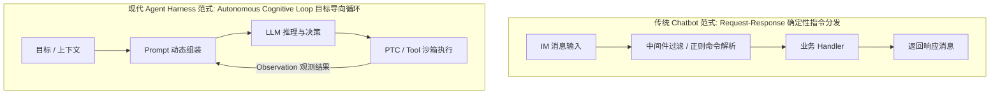
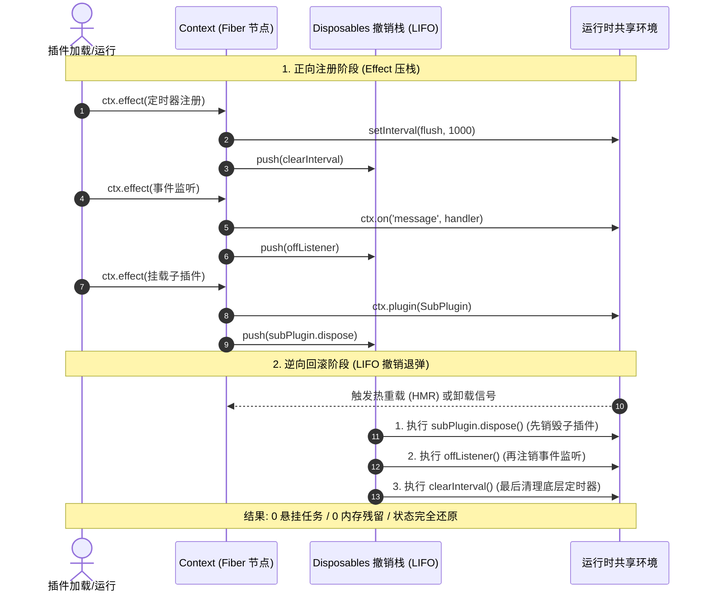
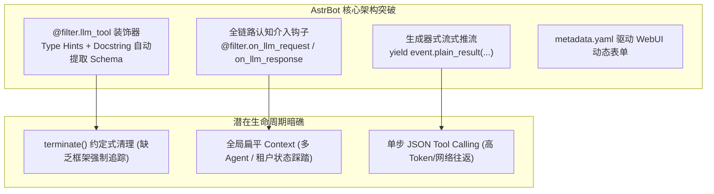
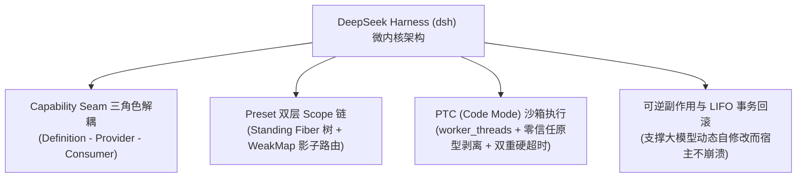

import GitHubCard from "@/components/mdx/GitHubCard.astro";
import SocialEmbed from "@/components/mdx/SocialEmbed.astro";
import { LinkPreview } from "astro-embed";

在软件架构的发展史上，**“系统如何优雅地支持第三方扩展与动态热插拔”** 始终是检验架构健壮度的终极考题。从早期 Eclipse 的 OSGi、VSCode 的 Extension Host，到跨平台聊天机器人（Chatbot），再到如今大模型驱动的 **智能体运行时（Agent Harness）**，插件系统的设计理念正在经历一次跨越式的范式重塑。

在这个重塑的过程中，三款具有里程碑意义的开源项目呈现出戏剧性的对比与交织：

<div class="grid grid-cols-1 md:grid-cols-2 gap-4 not-prose my-6">
  <GitHubCard repo="koishijs/koishi" description="拥有严格的状态逆向追踪（插件卸载时能像‘事务回滚’一样彻底清理副作用）与声明式依赖注入。" />
  <GitHubCard repo="AstrBotDevs/AstrBot" description="面向大模型与 Agent 生态的 Python 异步聊天机器人框架，主打极简开发体验与多模态扩展。" />
  <GitHubCard repo="deepseek-ai/deepseek-harness" description="DeepSeek 开源的操作系统级 Agent 运行时，提出 Everything is a plugin，深度集成 Cordis。" />
  <GitHubCard repo="cordiverse/paper" description="《A Programming Paradigm for Spatiotemporal Composability》Cordis 核心设计学术论文。" />
</div>

- **Koishi**：背靠在形式化理论与代数可逆性上登峰造极的 **Cordis 微内核**，拥有完备的原型链代理、LIFO 撤销栈与零重启热重载（HMR），但在大模型时代的生态声量上却显露出象牙塔式的落寞；
- **AstrBot**：在 Python 异步生态中高举实用主义大旗，凭借极简的 `@filter.llm_tool` 声明、Docstring 自动生成 Tool Schema 以及全链路认知钩子，在短时间内赢得了爆发式的社区生态，却也在底层埋下了不可逆的生命周期暗礁；
- **DeepSeek Harness（dsh）**：DeepSeek 发布的 Agent 运行时，却反常地直接将 Cordis 源码 Vendor 进核心仓库（`@deepseek-ai/cordis`），确立了 **“Everything is a plugin”** 的操作系统级架构，使可逆微内核在“自进化智能体（Self-Evolving Agent）”的语境下完成了历史性的救赎。

本文将基于三个项目的**官方源码实现、架构设计文档与真实社区工程实践**，剥离泛泛而谈的表面概念，用深入浅出的工程化语言展开深度技术论证。

---

## 1. 范式转移：从“消息路由”到“认知循环”

在深入代码细节前，我们必须首先厘清聊天机器人（Bot）与智能体运行时（Agent Harness）在**计算模型**上的本质差异：



- **传统 Bot 的核心诉求**是 **“协议抹平与路由分发”**：如何把来自 QQ、Discord、Telegram、微信的异构消息格式转化为统一的 `Session`，并高效匹配给对应的指令处理函数（如 `/help`、`/ban`）；
- **现代 Agent 的核心诉求**是 **“状态维持、环境交互与认知闭环”**：它需要维持多轮上下文的精确投影、在受控沙箱中执行任意代码、支持 **PTC（Programmatic Tool Calling，编程式工具调用 / Code Mode，即允许模型直接写代码调工具）**，甚至**允许大模型在执行过程中动态修改自身组件并安全回滚**。

这一计算模型的根本转变，直接导致了早期看似完美的 Bot 插件框架在进入 Agent 时代时出现严重的水土不服，也催生了新一代运行时的架构重构。

---

## 2. 象牙塔中的微内核：Koishi 与 Cordis 的得与失

### 2.1 Cordis 的形式化美感：可逆副作用与时空可组合性

由 Shigma 设计的元框架 **[Cordis](https://cordis.chat/)**（其学术阐述见《*A Programming Paradigm for Spatiotemporal Composability*》）在软件架构层面具有极高的理论纯度。

> [!NOTE]
> **💡 白话拆解：什么是“时空可组合性”？**  
> 论文标题听起来很深奥，但通俗讲就是：**空间上任意嵌套子插件（空间解耦），时间上无论何时加载、卸载或热更新，系统状态都能像事务一样精确回滚到最初（时间可逆）。**

Cordis 提出：**任何通过上下文修改环境的行为都是“副作用（Side-Effect）”**。无论是注册事件（`ctx.on`）、挂载中间件（`ctx.middleware`）、注册指令（`ctx.command`）、启动定时器，还是加载子插件（`ctx.plugin`），全部被严格规约为单一原语 `ctx.effect()`。

```typescript
// Cordis 核心思想：注册动作与撤销动作对称绑定
export function apply(ctx: Context) {
  ctx.effect(() => {
    // 1. 产生副作用 (Effect)
    const off = ctx.on('message', handler);
    const timer = setInterval(flush, 1000);

    // 2. 交付逆操作 (Disposer)
    return () => {
      clearInterval(timer); // 后注册，先销毁
      off();
    };
  });
}
```

### 2.2 通俗解构：什么是 LIFO 撤销栈与原型链代理？

> [!NOTE]
> **💡 通俗类比：弹夹装弹与退弹**
> 
> 很多初学者不理解为什么 Cordis 要强调 **LIFO（后进先出）撤销栈**。  
> 想象你在组装一台复杂的仪器：你先安装了底座（A），在底座上插了支架（B），最后在支架上拧上了镜头（C）。  
> 如果你想拆卸这台仪器，你**绝不能先拔掉底座 A**（否则支架和镜头会直接摔碎），你必须按照 **C $\rightarrow$ B $\rightarrow$ A** 的完全相反顺序逆向拆卸。  
> 
> Cordis 的 `disposables` 栈就是这个严谨的拆卸记录本：子插件必定随父插件逆序销毁，后注册的事件监听必定先被注销。

在 Cordis 运行时中，每个插件加载时都会创建一个 **Fiber 节点**（注：*在 Cordis 中，Fiber 是挂载在插件上的“生命周期追踪卡”，记录了插件当前处于等待依赖就绪 PENDING、正在运行 ACTIVE 还是已被卸载 DISPOSED*）。每次调用 `ctx.effect()`，返回的撤销函数就会被推入栈中：

```typescript
// 插件卸载或重载时，按逆序精确回滚所有副作用
disposables.splice(0).reverse().forEach(dispose => dispose());
```



当插件卸载（`fork.dispose()`）或进行热重载（HMR）时，系统按逆序弹出并执行所有清理函数。这从数学上保证了插件卸载后 **0 内存残留、0 悬空监听器、0 僵尸协程**。

同时，Cordis 抛弃了传统的全局服务字典，利用 JavaScript 原型链（`Context.prototype`）挂载访问器（Getter/Setter）。当开发者在代码中声明 `inject: ['database']` 时，框架会利用 Fiber 状态机自动将插件挂起，直到依赖的服务被加载才激活；若数据库服务发生重启，依赖它的所有插件会自动触发回滚并重新挂载。

---

### 2.3 为什么理论完美的 Koishi 遭遇了生态困境？真实论据拆解

然而，在近年的开源生态博弈中，Koishi 并没有在开发者群体中掀起与 AstrBot 或同类框架相当的爆发力。

> [!IMPORTANT]
> **辩证看待 Koishi 的历史探索**：Koishi 团队并非没有尝试大模型与多平台演进——其主导的 **Satori 协议** 成功将异构聊天平台的消息元素进行了高度结构化建模，社区也涌现了大量基于对话流的问答扩展。  
> **然而，受限于其深层的确定性 CLI 交互遗产与高昂的抽象税，这套精密的微内核终究未能直接点燃 AI 智能体的生态爆发。**

#### 论据一：范式错位 —— CLI 消息路由 vs. 目标导向的 Agent Loop
Koishi 是一套深度面向 **CLI 风格交互与 IM 消息流** 设计的系统：
- 它的核心 API 围绕 `ctx.command('foo <bar> [baz:number]')`、参数选项解析（`-f, --force`）、交互式会话等待（`session.prompt()`）以及中间件洋葱模型（`next()`）构建；
- 这套模型在处理“用户输入 `/ban @user -d 7`”这类确定性指令时极度优雅，但**与 LLM 的认知架构完全脱节**；
- 在大模型语境下，系统不再依赖预定义的命令行语法解析器，而是依赖 **Prompt 动态组装、Tool Calling 的 JSON Schema 动态自省、Thought-Action-Observation 循环与上下文截断**。Koishi 原本引以为傲的复杂指令解析系统，在 LLM 时代反而成了多余的中间层包袱。

#### 论据二：抽象税过载 —— 框架的优雅沦为开发者的心智负债
Cordis 的微内核设计为了追求数学上的严谨性，向开发者征收了极其沉重的“抽象税”：

```typescript
// 真实的 Koishi / Cordis 服务定义与副作用绑定范式
import { Context, Service } from 'koishi';

// 1. 强制的 TypeScript 声明合并 (全局命名空间侵入)
declare module 'koishi' {
  interface Context {
    myDatabase: MyDatabaseService;
  }
}

// 2. 自定义服务实现与调用者上下文追踪
export class MyDatabaseService extends Service {
  constructor(ctx: Context) {
    // 声明服务名称并挂载到 Context.prototype
    super(ctx, 'myDatabase', true);
  }

  public registerTable(tableName: string) {
    // ⚠️ 必须通过 Symbol 捕获调用者上下文以防跨作用域泄漏
    const caller = this[Context.current];
    if (!caller) return;

    // 绑定调用者生命周期：调用者被卸载时，自动反注册表结构
    caller.on('dispose', () => {
      this.dropTable(tableName);
    });
  }
}
```

对于占据开源社区 80% 的长尾开发者（只想写个小脚本、调个私有 API、挂个知识库）而言，必须理解 **TypeScript 命名空间合并、原型链属性拦截器、调用者 Symbol 上下文追踪**，构筑了高耸的准入门槛。

#### 论据三：大模型工具自省（Introspection）机制的缺位
在 Koishi 中将一个业务函数暴露给大模型，缺少原生的、第一优先级的声明机制。开发者需要自行编写 JSON Schema 描述，或者通过复杂的胶水代码将 Command 系统转译给 LLM，严重拖慢了 AI 插件的产出速度。

---

## 3. 泥泞中的实用主义狂欢：AstrBot 的突破与架构暗礁

[AstrBot](https://github.com/AstrBotDevs/AstrBot) 的崛起，是典型的**“实用主义与极简 DX 对学院派架构的降维打击”**。



### 3.1 AstrBot 真正做对了什么？DX 降维打击的技术论证

深入阅读 [AstrBot AI 模块指南](https://github.com/AstrBotDevs/AstrBot/blob/master/docs/zh/dev/star/guides/ai.md) 与 [插件配置文档](https://github.com/AstrBotDevs/AstrBot/blob/master/docs/zh/dev/star/guides/plugin-config.md)，可以清晰发现其在 AI 交互层面的四大杀手级设计：

#### 亮点一：`@filter.llm_tool` 的自动类型与 Docstring 反射
AstrBot 彻底干掉了手动书写 JSON Schema 的痛苦过程。开发者只需要编写最符合 Python 习惯的函数与注释：

```python
# 摘自 AstrBot 插件开发范式: 自动自省 Tool Schema
from astrbot.api.event import filter, AstrMessageEvent
from astrbot.api.star import Star, Context

class WeatherPlugin(Star):
    def __init__(self, context: Context):
        super().__init__(context)

    @filter.llm_tool(name="fetch_weather")
    async def fetch_weather(self, event: AstrMessageEvent, city: str, days: int = 1):
        '''
        获取指定城市的实时天气及未来几天的气温趋势。
        Args:
            city(string): 城市名称，如 "北京" 或 "Tokyo"
            days(number): 查询天数，默认为 1 天，最多 7 天
        '''
        return f"{city} 未来 {days} 天天气预报: 晴朗，气温 22℃"
```

> [!TIP]
> **💡 通俗拆解：反射魔法如何工作？**
> 
> 在底层，AstrBot 的正则引擎解析函数注释中的 `Args:` 块（如 `city(string): 城市名称`），直接在内存中自动拼装成大模型需要的标准 JSON Schema：
> ```json
> {
>   "name": "fetch_weather",
>   "description": "获取指定城市的实时天气...",
>   "parameters": {
>     "type": "object",
>     "properties": {
>       "city": { "type": "string", "description": "城市名称" },
>       "days": { "type": "number", "description": "查询天数", "default": 1 }
>     },
>     "required": ["city"]
>   }
> }
> ```
> **官方设计细节**：AstrBot 官方文档明确指出，`@filter.llm_tool` 强制要求规范的 `Args:` 注释段，正是通过将参数描述内嵌在 Docstring 中，实现了“代码即文档、文档即 Schema”的极简开发体验。

#### 亮点二：全链路认知介入钩子（Pipeline Hooks）
AstrBot 提供了精细的大模型请求与响应拦截点：
- `@filter.on_llm_request(priority=...)`：允许插件在 Prompt 发往模型前，动态向 `req.extra_user_content_parts` 注入自定义上下文（如当前系统时间、用户好感度、RAG 检索片段）；
- `@filter.on_llm_response(priority=...)`：在 LLM 生成结果后直接拦截原始文本，完成内容安全脱敏或结构化解析；
- `@filter.on_decorating_result()`：在最终消息生成阶段，往 `MessageChain` 追加图片、语音（TTS）或格式化卡片。

#### 亮点三：双模态分发与生成器消息流（yield MessageChain）
同一个 Handler 既可通过 `@filter.command` 响应传统人类指令，也可通过 `@filter.llm_tool` 供 AI 调用。支持基于 Python 异步生成器的 `yield event.plain_result(...)` 分阶段推流，天然适配大模型的打字机流式输出。

#### 亮点四：Schema 驱动的 WebUI 动态渲染
插件仅需附带一份 `metadata.yaml` 声明配置字段，AstrBot 后台管理面板就能自动反射渲染出可视化的配置界面、开关与下拉菜单，彻底免去了终端用户手动编辑配置文件的痛苦。在 `v4.5.7+` 中，AstrBot 更进一步引入了 `self.context.tool_loop_agent()` 与 `agent-as-tool` 的 Multi-Agent 编排机制。

---

### 3.2 尖锐批判：缺乏形式化约束的“生命周期悬崖”

然而，在极致 DX 的光环背后，AstrBot 的底层架构设计暴露出严重的工程隐患：

#### 隐患一：`terminate()` 约定式清理在异步协程下的失效陷阱
AstrBot 的生命周期依赖开发者自觉在 `async def terminate(self): pass` 中编写清理逻辑。

```python
# 真实的潜在内存泄漏范例
class RiskyPlugin(Star):
    def __init__(self, context: Context):
        super().__init__(context)
        # 1. 开启了后台长轮询任务
        self.bg_task = asyncio.create_task(self.polling_loop())
        # 2. 外部 SDK 注册了强引用监听
        external_sdk.register_listener(self.on_callback)

    async def terminate(self):
        # ❌ 如果开发者忘记显式调用 self.bg_task.cancel()
        # 插件热重载或停用后，旧的 Task 依旧在 asyncio loop 中静默运行并持有插件实例！
        pass
```

在 Python 的异步生态中，协程缺少 **Cancellation Invariant（取消不变量）** 的强制保障：`asyncio` 虽然支持 `Task.cancel()`，但由于框架层没有将 `Task` 作为第一公民纳管进生命周期树，导致清理责任被完全转嫁给开发者自觉。在官方开发指南中，虽然明确提醒开发者“必须在 `terminate` 中手动清理后台任务”，但在实际工程实践中，一旦第三方插件作者疏忽，未被取消的后台协程就会持续在事件循环中静默运行，引发资源悬挂。

#### 隐患二：扁平全局上下文下的状态踩踏与多 Agent 隔离缺失
AstrBot 的插件与工具早期全部注册在全局平铺的命名空间中。
- 当系统接入数十个插件时，同名工具（如不同插件都定义了 `search`）必然产生冲突；
- 尽管 AstrBot 在 `v4.5.x` 引入了 `ToolSet`（工具集）与 `agent-as-tool`（多智能体委托）机制，但在处理 Persona（人格预设）过滤、权限收敛以及跨 Sub-Agent 上下文交接时，底层缺乏像 Cordis 那样严格的树状 Scope 原型隔离，仍需在应用层做大量的动态字典合并与状态同步。

#### 隐患三：单步 JSON Tool Calling 的通信与延迟瓶颈
面对长程任务（如批量处理 50 个文件），单步 JSON Tool Calling 必须经历 50 次完整的 LLM 推理往返，极易耗尽上下文窗口并产生巨大的延迟，缺乏在沙箱中让模型编写完整 Python 脚本批量调度的能力。

---

### 3.3 AstrBot 架构的自救路线：实用主义的渐进式改良

从 AstrBot 近期从单一 Bot 向 `tool_loop_agent` 与 `agent-as-tool` 演进的官方开发趋势可以看出，项目正在大步迈向 Agent 原生化。在此背景下，AstrBot 并不需要完全推倒重来去复刻一套复杂的 Cordis，而是在保持当前杀手级 DX 的前提下，由框架底层接管脏活累活：

1. **托管式协程上下文（Managed Async Context）**：
   * **消除手动清理负担**：针对官方文档中反复强调的“手动在 `terminate` 取消 Task”的痛点，框架可在 `Star` 基类中提供 `self.create_task()` 替代原生的 `asyncio.create_task()`。
   * **实现机制**：由基类自动使用 `WeakSet` 收集当前插件产生的所有 `Task` 与 `ClientSession`。在插件卸载或重载时，基类统一执行 `cancel()` 与 `close()`，无需开发者在 `terminate()` 中手动书写脆弱的防护代码；
2. **基于 ToolSet 的分层 Scope 与命名空间隔离**：
   * 顺应 AstrBot 现有的 `ToolSet` 与 Persona 演进方向，在 Event 与 Tool 之间引入正式的层级 `Scope` 树，支持按群聊/会话/Sub-Agent 挂载独立的工具视图与事件总线，避免全局平铺下的工具重名踩踏与权限溢出；
3. **引入轻量级批量执行器（Sub-Agent Batching / PTC 沙箱）**：
   * 在 `tool_loop_agent()` 之外，引入支持直接运行 Python 脚本的轻量沙箱（如 Pyodide 或独立子进程），赋予模型循环编排工具的能力，大幅降低多步任务的 Token 消耗与网络往返延迟。

---

## 4. 微内核的终极救赎：DeepSeek Harness (dsh) 的破局与代价

当智能体框架从“辅助对话”迈向“全自主软件工程（SWE）与跨系统自动化”时，**系统的容错底线被彻底打破了**。

正是在这一背景下，DeepSeek Harness（dsh）选择将 Cordis 作为底层核心，完成了对微内核架构的史诗级正名。



### 4.1 Cordis 的正名：自进化 Agent 为什么必须依赖代数级可逆性？

在人类写代码的时代，系统崩溃了，人工重启进程只需两秒。**但未来的 Agent 是自进化的（Self-Evolving）**——大模型在执行任务时，会根据错误反馈动态生成新的插件代码并即时热加载到自身环境中。

如果采用传统的弱生命周期架构：
> Agent 编写了一个带 Bug 的新工具 $\rightarrow$ 动态加载失败 $\rightarrow$ 产生悬空定时器并污染全局状态 $\rightarrow$ 宿主进程崩溃 $\rightarrow$ **自进化中断，系统死亡**。

在 DSH + Cordis 体系下：
> Agent 编写新工具 $\rightarrow$ Fiber 状态机加载 $\rightarrow$ 校验或运行报错 $\rightarrow$ **触发 LIFO 撤销栈完整事务回滚** $\rightarrow$ 状态还原至加载前 $\rightarrow$ **宿主毫发无损，Agent 捕获错误并尝试生成修复版本**。

**Cordis 极其苛刻的可逆副作用追踪，正是让 Agent 在不重启进程、不丢状态前提下实现“自我手术”的唯一数学解。**

> [!NOTE]
> **💡 深度揭秘：为什么 DeepSeek 选择 Vendor Cordis 而非 npm 依赖？**  
> DeepSeek 团队之所以直接 Vendor Cordis 源码（`@deepseek-ai/cordis`），一方面是彻底剥离了 Koishi 历史包袱中的 CLI/Satori 聊天协议耦合，另一方面是针对多 Agent 高并发场景定制了 WeakMap 影子路由与零拷贝状态共享，并注入了 18 项底层 Fiber 状态机稳定性补丁。

---

### 4.2 能力接缝（Capability Seams）：环境解耦的三角色咬合模型

DSH 将所有基础设施抽象为 **Capability Seam**，包含三个严格角色（以 `packages/shell` 为例）：

```
┌─────────────────────────────────────────────────────────────┐
│                 1. Service Definition (接口契约)             │
│                    dsh-shell (抽象服务定义)                  │
├──────────────────────────────┬──────────────────────────────┤
│ 2. Provider (环境提供方)      │ 3. Consumer (业务工具消费者)  │
│   • dsh-bash-local (本地机器) │   • dsh-tool-bash (命令行)   │
│   • dsh-bash-sandbox (沙箱)  │   • dsh-tool-git (版本控制)  │
└──────────────────────────────┴──────────────────────────────┘
```

```mermaid
graph LR
    subgraph Consumer ["3. 业务工具消费者 (面向契约编程)"]
        TB["dsh-tool-bash<br/>(只调用 ctx.shell.exec)"]
        TG["dsh-tool-git<br/>(只调用 ctx.shell.exec)"]
    end

    subgraph Seam ["1. Service Definition (能力接缝契约)"]
        SEAM["Context.service('shell')<br/>ShellService 抽象接口"]
    end

    subgraph Providers ["2. Provider (环境实现方: 配置热切换)"]
        PL["dsh-bash-local<br/>(node:child_process 本地进程)"]
        PS["dsh-bash-sandbox<br/>(Docker / Landlock 内核微沙箱)"]
    end

    TB --> SEAM
    TG --> SEAM
    SEAM -.->|开发环境挂载| PL
    SEAM -.->|生产环境热替换 (0 工具代码修改)| PS
```

```typescript
// 真实的 Capability Seam 三角色代码对齐范式

// 1. Definition (契约): 仅声明接口类型与注入契约
export interface ShellService {
  exec(cmd: string, options?: ExecOptions): Promise<ExecResult>;
}
declare module '@deepseek-ai/cordis' {
  interface Context { shell: ShellService; }
}

// 2. Provider A (本地实现): 注入本地子进程执行
export class LocalShellService extends Service implements ShellService {
  constructor(ctx: Context) { super(ctx, 'shell', true); }
  async exec(cmd: string) { return child_process.execAsync(cmd); }
}

// 2. Provider B (沙箱实现): 注入远程容器/Landlock 隔离执行
export class SandboxShellService extends Service implements ShellService {
  constructor(ctx: Context) { super(ctx, 'shell', true); }
  async exec(cmd: string) { return this.sandboxClient.runIsolated(cmd); }
}

// 3. Consumer (业务工具): 纯粹面向契约编程，环境完全透明
export class BashTool extends Service {
  static inject = ['shell']; // 声明式依赖
  constructor(ctx: Context) {
    super(ctx, 'tool.bash', true);
    ctx.tools.register({
      name: 'bash',
      call: async (args) => ctx.shell.exec(args.command), // 0 环境硬编码！
    });
  }
}
```

> [!NOTE]
> **💡 通俗类比：标准电源插座与电器**
> 
> - **Service Definition（契约）** 就是墙上的 **“国标五孔插座”**；
> - **Provider（环境提供方）** 可以是 **“国家电网”**（本地真实执行），也可以是 **“柴油发电机”**（安全沙箱容器）；
> - **Consumer（业务工具）** 就是你的 **“手机充电器”**。  
> 
> 充电器（工具代码）只需要对着插座标准插进去，它根本不需要关心背后供电的是火电厂还是发电机。**切换环境时，业务工具 0 代码修改！**

---

### 4.3 破除性能瓶颈：Preset 双层 Scope 与 WeakMap 影子路由

针对重型插件（LSP、AST 代码分析器、大词表）初始化极慢的问题，如果每次开启新对话都完整重新加载一次，系统会产生显著的卡顿。为此，DSH 设计了“公共模板 + 影子路由”的双层机制：

> [!TIP]
> **💡 通俗拆解：印章与白纸**  
> DSH 将重型预设配置（`agent.cordis.yml`）在启动时只完整编译、激活一次（`ensureStanding()`），作为**公共只读模板**常驻内存；  
> 当用户开启新会话（Session）时，系统不再重新走一遍繁重的插件加载流程，而是**在 `WeakMap` 中记录一条指向该模板的父子映射（影子路由）**。

这使得新会话的派生耗时直接压缩至**百微秒级**，完美兼顾了重型组件的隔离性与高并发下的轻量复用。

---

### 4.4 编程式工具调用（PTC）与 worker_threads 零信任沙箱

DSH 实现了 **PTC（Programmatic Tool Calling）**，允许大模型直接编写一段完整的 TypeScript 脚本，在沙箱内完成多工具的并发调度与数据清洗。在沙箱实现上，DSH 选用了 **`node:worker_threads`**，构建了严格的零信任防线：

1. **原型链彻底剥离**：暴露给代码的 `tools` 对象使用 `Object.create(null)` 创建，封死一切试图通过 `__proto__` 或 `constructor` 逃逸到宿主全局对象的路径；
2. **IPC 结构化消息通信**：Worker 沙箱与宿主之间仅传递纯数据消息，宿主按标准流水线进行严格的权限鉴权与消息校验（防止重放攻击）；
3. **物理墙钟硬超时强杀**：基于事件循环利用率计算 CPU 时间，并配合宿主 `setTimeout` 物理定时器兜底，一旦检测到死循环或长时间无响应，直接调用 `worker.terminate()` 强制销毁。

```typescript
// DSH PTC (Code Mode) 沙箱初始化与原型链切断核心原语
import { Worker, parentPort } from 'node:worker_threads';

// 1. 零信任原型剥离: 使用 Object.create(null) 切断一切 __proto__ 逃逸
const sandboxTools = Object.create(null);
for (const [toolName, toolMeta] of Object.entries(registeredTools)) {
  sandboxTools[toolName] = async (params: unknown) => {
    // 2. 双向 IPC 通信: 仅通过结构化纯数据消息与宿主交互
    return new Promise((resolve, reject) => {
      const callId = crypto.randomUUID();
      pendingCalls.set(callId, { resolve, reject });
      parentPort!.postMessage({ type: 'TOOL_INVOKE', callId, toolName, params });
    });
  };
}

// 3. 双重硬超时守护: CPU 利用率监测 + 宿主物理定时器兜底
export function runSandboxedPTC(code: string, timeoutMs = 30000) {
  const worker = new Worker(WORKER_ENTRY_SCRIPT, { workerData: { code } });
  
  // 物理墙钟超时守卫 (Wall-clock Guard)
  const timer = setTimeout(() => {
    worker.terminate(); // 强杀死循环
    throw new Error(`PTC Execution Timed Out after ${timeoutMs}ms`);
  }, timeoutMs);

  worker.on('exit', () => clearTimeout(timer));
  return worker;
}
```

---

### 4.5 客观审视：DeepSeek Harness 的缺陷与工程代价

任何架构都有取舍。DSH 在实现极致微内核与安全性的同时，也付出了沉重的工程代价：

1. **惊人的工程复杂度壁垒**：
   - 整个仓库拆分了 **200+ 个 npm 包**，采用复杂的双 aggregate 编译（`tsconfig.host.json` vs `tsconfig.client.json`）与 Typert RPC 代码生成；
   - 对于普通社区开发者而言，想要为 DSH 贡献核心代码或开发深度插件，学习曲线极其陡峭；
2. **`worker_threads` 的启动开销**：
   - 相比于像 Codex 那样复用常驻的 V8 Isolate，每次执行 Code Mode 单独创建与销毁 Node 工作线程，在高频轻量调用下会产生明显的 CPU 与内存抖动；
3. **HMR 在深层复杂状态下的脆弱性**：
   - 正如一线开发者实测所指出的，当插件深度嵌套复杂的 UI 视图与双向状态同步时，运行时的热重载依旧存在偶发破坏 WebUI 的稳定性问题；
4. **产品化包装尚处早期**：
   - 目前仍属于 Developer Preview 阶段，需要终端环境手动编译拉起，距离成为面向普通用户的开箱即用桌面产品仍有明显差距。

---

## 5. 三代架构全景对比演进矩阵

| 架构维度 | 第一代：Koishi (Cordis 内核) | 第二代：AstrBot (Star 体系) | 第三代：DeepSeek Harness (dsh) |
| :--- | :--- | :--- | :--- |
| **设计核心哲学** | 纯粹的数学级时空可组合性 | 实用主义驱动的极简 DX | **一切皆插件（微型操作系统内核）** |
| **主要技术栈** | TypeScript / Node.js | Python 3.10+ / `asyncio` | TypeScript / Node.js 22+ (ESM) |
| **核心计算模型** | Request-Response 指令分发 | Request-Response + 认知钩子 | **Autonomous Cognitive Loop（自进化认知循环）** |
| **内核特权级别** | 框架核心管理事件流与适配器 | 框架管理消息路由与 Provider | **零特权（微内核机制）**：Agent Loop / UI 全是普通插件 |
| **生命周期可靠性** | **严格（`ctx.effect()` LIFO 撤销栈）** | 脆弱（依赖 `terminate()` 约定式清理） | **严格（LIFO 撤销栈 + Fiber 六状态机）** |
| **依赖注入 (DI)** | 声明式 `inject` + 拓扑自激活 | 基础 Context 参数透传 | 声明式 `inject` + Capability Seam 三角色解耦 |
| **工具调用范式** | 指令系统 (`ctx.command`) | 传统指令 + 装饰器 LLM Tool | **PTC 编程式调用 (`worker_threads`) + 结构化 Tool** |
| **作用域与复用** | 链式 Filter Predicate 过滤树 | 扁平全局 Context | **Preset 实体 + WeakMap 影子路由（微秒级）** |
| **沙箱安全机制** | 进程内权限中间件拦截 | Python 应用层权限过滤 | **内核级 Landlock / bwrap + 默认拒绝 (Fail-Closed)** |
| **自进化容错能力** | 具备基础 HMR 回滚能力 | 较弱（报错易导致模块状态污染） | **原生级支持（坏插件原子回滚，宿主永生）** |

---

## 6. 启示录：面向未来的 Agent 运行时设计公理

综合解构 Koishi、AstrBot 与 DeepSeek Harness 的成败得失，我们可以为下一代智能体运行时的设计确立四条核心公理：

### 公理一：代数级可逆性是自进化智能体的生存底线
> **“无法安全卸载的插件，从第一天起就注定了长程系统的崩溃。”**

如果系统允许大模型在运行期自主编写工具和扩展，框架底座就必须具备确定性的副作用逆向追踪能力。任何环境修改必须可归约为带 LIFO 撤销语义的原语。

### 公理二：不要让开发者为“架构优雅”买单 —— 极简声明，编译器兜底
Koishi 输在门槛，AstrBot 赢在体验。
未来的框架必须学习 AstrBot 的表面设计——提供最符合直觉的装饰器与自动自省机制，但将严苛的 Effect 追踪与服务依赖下沉至底层编译器与运行时中静默完成。**“把极简留给开发者，把严谨留给编译器”。**

### 公理三：环境与业务工具必须做 Seam 级彻底解耦
工具代码不应直接与具体的操作系统 API 或沙箱容器绑定。必须将环境能力抽象为 Seam（接口 - 提供者 - 消费者），实现单机开发与云端多租户沙箱的无感漫游。

### 公理四：编程式调用（PTC）必将终结单步 JSON 交互
单步 JSON Tool Calling 在复杂场景下已经触碰到了延迟与 Token 消耗的物理天花板。
赋予大模型编写脚本编排工具的能力（PTC），并依托轻量级隔离线程与操作系统内核级沙箱（Landlock/bwrap）守住安全底线，是通往高效通用 Agent 的必由之路。

---

## 7. 参考文献与官方文档直达

本文的技术论述基于以下核心开源项目源码与技术文档：

1. **Cordis 核心设计理论与元框架**
   - Shigma et al., *A Programming Paradigm for Spatiotemporal Composability* (Cordis 核心设计论文), [GitHub: cordiverse/paper](https://github.com/cordiverse/paper)
   - Cordis 官方设计文档与 API 规范: [https://cordis.chat/](https://cordis.chat/)
2. **Koishi 跨平台机器人系统**
   - Koishi 官方开发指南与插件架构: [https://koishi.chat/zh-CN/guide/plugin/](https://koishi.chat/zh-CN/guide/plugin/)
   - 开源仓库: [GitHub: koishijs/koishi](https://github.com/koishijs/koishi)
3. **AstrBot 智能体机器人架构与 Star 体系**
   - AstrBot 官方开发文档源码: [GitHub: AstrBotDevs/AstrBot docs](https://github.com/AstrBotDevs/AstrBot/tree/master/docs/zh/dev/star/guides)
   - AI 模块与 Tool 接口定义: [`docs/zh/dev/star/guides/ai.md`](https://github.com/AstrBotDevs/AstrBot/blob/master/docs/zh/dev/star/guides/ai.md)
   - 插件配置与 Schema 规范: [`docs/zh/dev/star/guides/plugin-config.md`](https://github.com/AstrBotDevs/AstrBot/blob/master/docs/zh/dev/star/guides/plugin-config.md)
4. **DeepSeek Harness (dsh) 架构解析与源码**
   - DeepSeek 官方开源仓库: [GitHub: deepseek-ai/deepseek-harness](https://github.com/deepseek-ai/deepseek-harness)
   - chino (腾讯WXG), [DeepSeek Harness 拆解：一套能拼装的 Agent 架构](https://mp.weixin.qq.com/s?__biz=MjM5ODYwMjI2MA==&mid=2649803587&idx=1&sn=a5ac30af9c015db111b60f947eb4e240&chksm=bf32466cee82ee47b51f2d8c3f441a33f7acc57b59d072fb75a8f17290987bc4f90a84d869f8&mpshare=1&scene=23&srcid=0815ZsbBcwLuevG0iMLkYJ6j&sharer_shareinfo=800826e0701505ca6e9e1ab432a1665d&sharer_shareinfo_first=800826e0701505ca6e9e1ab432a1665d#rd)
