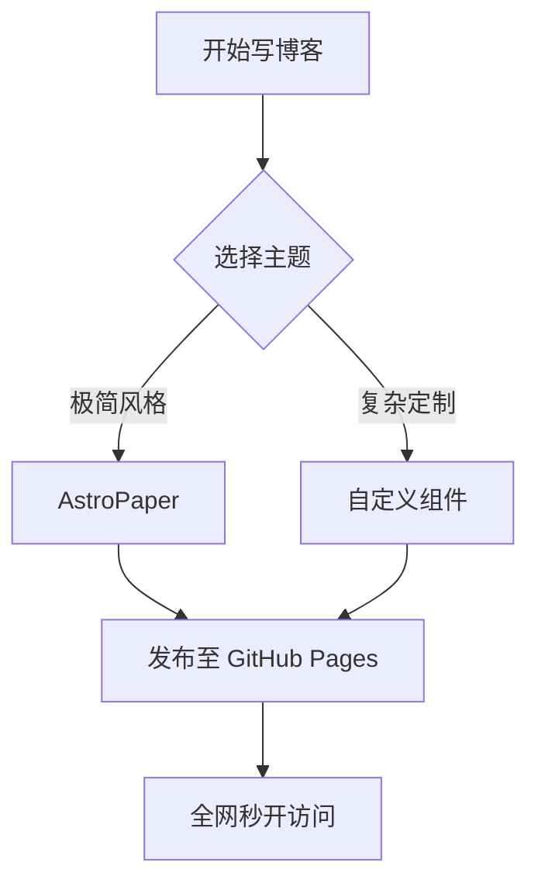

import { Icon } from "astro-icon/components";
import { Tweet, YouTube, LinkPreview } from "astro-embed";
import CodePen from "@/components/mdx/CodePen.astro";
import Bilibili from "@/components/mdx/Bilibili.astro";
import NetEaseMusic from "@/components/mdx/NetEaseMusic.astro";
import AudioPlayer from "@/components/mdx/AudioPlayer.astro";
import GitHubCard from "@/components/mdx/GitHubCard.astro";

在 Astro 中写博文非常强大，因为通过 **MDX**，我们可以像写普通 Markdown 一样写作，同时随时插入交互式组件与多媒体。

---

## 1. 庞大的图标库生态（`astro-icon`）

无需引入笨重的静态字体包，构建时自动编译为轻量 SVG：

<div class="flex flex-wrap items-center gap-6 my-4 p-4 rounded-xl border border-border bg-foreground/5 not-prose">
  <div class="flex items-center gap-2">
    <Icon name="lucide:sparkles" class="size-6 text-accent" />
    <span>Lucide Sparkles</span>
  </div>
  <div class="flex items-center gap-2">
    <Icon name="tabler:brand-github" class="size-6 text-accent" />
    <span>GitHub</span>
  </div>
  <div class="flex items-center gap-2">
    <Icon name="simple-icons:bilibili" class="size-6 text-[#00A1D6]" />
    <span>Bilibili</span>
  </div>
  <div class="flex items-center gap-2">
    <Icon name="lucide:music" class="size-6 text-accent" />
    <span>Music</span>
  </div>
</div>

```mdx
import { Icon } from "astro-icon/components";

<Icon name="lucide:sparkles" class="size-6 text-accent" />
<Icon name="simple-icons:bilibili" class="size-6" />
```

---

## 2. 社交媒体与在线沙盒嵌入

### 嵌入 CodePen 在线可交互代码
读者可以直接在博文内查看效果，并在线修改 HTML/CSS/JS：

<CodePen id="https://codepen.io/argyleink/pen/eYpRgpy" />

```mdx
import CodePen from "@/components/mdx/CodePen.astro";

<CodePen id="https://codepen.io/argyleink/pen/eYpRgpy" />
```

---

## 3. GitHub 开源项目动态卡片

在博文中介绍项目或推荐开源库：

<GitHubCard
  repo="SXP-Simon/SXP-Simon.github.io"
  description="Helian's Minimalist Personal Blog built with Astro and AstroPaper."
  language="TypeScript"
/>

```mdx
import GitHubCard from "@/components/mdx/GitHubCard.astro";

<GitHubCard
  repo="SXP-Simon/SXP-Simon.github.io"
  description="项目简要说明..."
  language="TypeScript"
/>
```

---

## 4. 国内音视频组件

### 哔哩哔哩（Bilibili）视频
<Bilibili bvid="BV1xx411c7mD" />

```mdx
import Bilibili from "@/components/mdx/Bilibili.astro";

<Bilibili bvid="BV1xx411c7mD" />
```

### 网易云音乐
<NetEaseMusic id="186016" />

```mdx
import NetEaseMusic from "@/components/mdx/NetEaseMusic.astro";

<NetEaseMusic id="186016" />
```

---

## 5. LaTeX 数学公式排版

支持行内公式如 $E = mc^2$ 以及块级公式：

$$
\int_{-\infty}^{\infty} e^{-x^2} dx = \sqrt{\pi}
$$

$$
f(x) = \frac{1}{\sigma \sqrt{2\pi}} e^{-\frac{1}{2}\left(\frac{x-\mu}{\sigma}\right)^2}
$$

---

## 6. Mermaid 流程图与时序图

在 Markdown 代码块中使用 `mermaid` 语言即可自动渲染：


